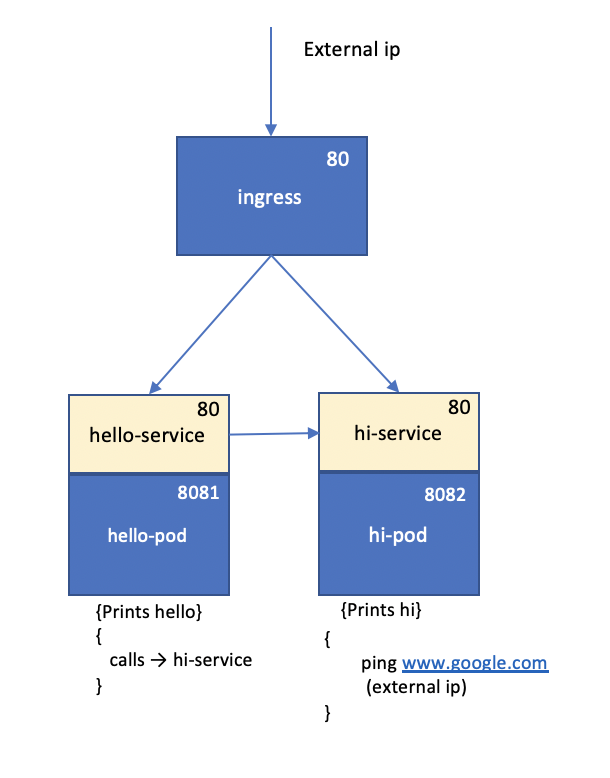
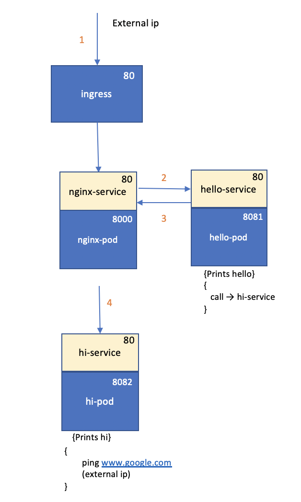

# kube-ingress-demo

Kubernetes ingress demo - Created a sample application to demo ingress flow with 2 services - Hello and Hi.

Example 1: (Without nginx)  

 

Example 2: (With nginx routing)  

 

- Install minikube and kubectl. Start with Virtualbox driver

  `minikube start --vm-driver virtualbox`

  `minikube addons enable ingress`

- Verify current context in Kubectl. Ensure it is minikube

  `kubectl config current-context`

- Start ingress-nginx pods using config in ingress-nginx directory

  `kubectl apply -f ingress-nginx`

- Find minikube ip address

  `minikube ip`

- Verify if Example-2 works

  `curl -kL http://192.168.99.100/hello`

- Stop and delete all pods

  `kubectl delete -f ingress-nginx`

Note:

- Currently the demo works only outside Oracle VPN.
  minikube can be configured to run within VPN, but it is not attempted.

- If you get error in pulling images from docker repository, please ensure you register your credentials in kubernetes secret store for private repositories.

  `kubectl create secret docker-registry regcred --docker-server=https://index.docker.io/v1/ --docker-username={ username } --docker-password={ password }--docker-email={ email }`

- If you get certificate error with ingress controller,

  See https://github.com/kubernetes/ingress-nginx/issues/4360

  `kubectl delete validatingwebhookconfiguration ingress-nginx-admission`

References:

https://gardener.cloud/050-tutorials/content/howto/service-access/ | starter

https://matthewpalmer.net/kubernetes-app-developer/articles/kubernetes-ingress-guide-nginx-example.html | Ingress vs Loadbalancer

https://matthewpalmer.net/kubernetes-app-developer/articles/service-kubernetes-example-tutorial.html | Service vs Deployment

https://kubernetes.io/docs/tasks/access-application-cluster/connecting-frontend-backend/ | hello greeter
